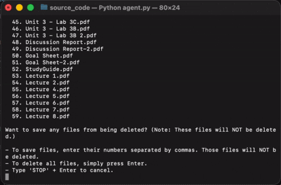

# HomeworkHeap

Tired of your Downloads folder looking like a digital graveyard of forgotten assignments? You know, that one PDF from "Physics: Electrodynamics and Special Relativity" that's been sitting there since 2022, mocking you every time you try to find that one picture you just saved? Or maybe you just graduated and want to chuck every last "Final_Exam_Study_Guide.pdf" into the trash forever? 

**HomeworkHeap** is here to save you from your cluttered Downloads folder. Using the power of AI (because apparently we need machine learning to figure out that "Essay_Draft_v3_FINAL_v2_ACTUALLY_FINAL.pdf" is school-related), this tool automatically identifies all your academic PDFs and helps you delete them forever—because sometimes the best closure is a `rm -rf` command. 🎓🗑️



## How It Works

**HomeworkHeap** follows a careful, step-by-step process to ensure you're always in control:

1. **📁 Scan & Classify**: The tool scans your `~/Downloads` folder for all PDF files, then uses AI to identify which ones appear to be school-related (essays, homework, exams, etc.)

2. **👀 Review & Edit**: Before any files are moved, you see a complete list of identified school-related files. You can:
   - Remove specific files from this list by entering their numbers
   - Press Enter to proceed with all files
   - Type "STOP" to completely cancel the operation—no files will be touched

3. **📦 Move to Staging**: The confirmed files are moved (not deleted) to an "Old Schoolwork" folder in your Downloads directory. This creates a safety buffer where you can review what was moved

4. **✅ Final Confirmation**: After files are moved, you must explicitly confirm by typing "yes" before the "Old Schoolwork" folder is permanently deleted. If you don't confirm, files remain in the staging folder where you can recover them later

5. **🗑️ Permanent Deletion**: Only after your explicit approval are the files permanently deleted

Every step requires your input—there are no silent deletions or automatic actions.

## Setup

To get started with **HomeworkHeap**, follow these steps:

1. **Install dependencies**: Navigate to the `source_code` directory and install the required packages:
   ```bash
   cd source_code
   pip install -r requirements.txt
   ```

2. **Configure your API key**: Create a `.env` file in the `source_code` directory (you can copy `example.env` as a template):
   ```bash
   cp example.env .env
   ```
   Then edit `.env` and add your OpenAI API key:
   ```
   OPENAI_API_KEY=your_openai_api_key_here
   ```
   You can get your API key from [OpenAI's platform](https://platform.openai.com/api-keys).

3. **Run the tool**: Execute the agent script:
   ```bash
   python agent.py
   ```

That's it! The tool will scan your `~/Downloads` folder and guide you through the cleanup process.

## Safety Features

**HomeworkHeap** includes multiple layers of protection to ensure your files are never accidentally deleted. Here's how we keep your data safe:

- 🛡️ **Downloads-only restriction**: The program only operates on your `~/Downloads` directory and validates that the path is exactly that—no other directories can be targeted
- 🔍 **LLM validation**: The AI's file classifications are cross-checked against the original file list—any filenames the AI "invents" are automatically rejected. The AI is instructed to be conservative—if it's unsure whether a file is school-related, it won't include it
- 🛟 **Error handling**: If classification fails for any reason, the program safely exits without moving any files


In summary: **HomeworkHeap never deletes files without your explicit approval, and it gives you multiple opportunities to review and cancel the operation before any permanent changes are made.**

## Lessons Learned: Finding the Right Scope for LLMs

Building this tool taught me an important lesson about working with LLMs: **they're powerful, but they're not perfect, and scope matters.**

Initially, I considered giving the LLM a much broader role—perhaps having it scan directories, read file contents, or make more complex decisions. But through testing, I discovered that expanding the LLM's scope led to significant problems:

- **Hallucination**: When given too much freedom, the LLM would "invent" filenames that didn't actually exist in my Downloads folder
- **Inconsistency**: Results varied between runs, making the tool unreliable
- **Overreach**: The model would try to be too helpful, making assumptions beyond what it should

The solution was to **strictly limit the LLM's scope** to a single, well-defined task: classifying filenames from a provided list. The program handles all file system operations, path validation, and error handling—tasks that require deterministic behavior. The LLM only does what it's good at: understanding semantic meaning from text (in this case, filenames).

This approach resulted in a more reliable tool. 

*P.S. I used an LLM to help me write this README. The irony is not lost on me.* 😅


